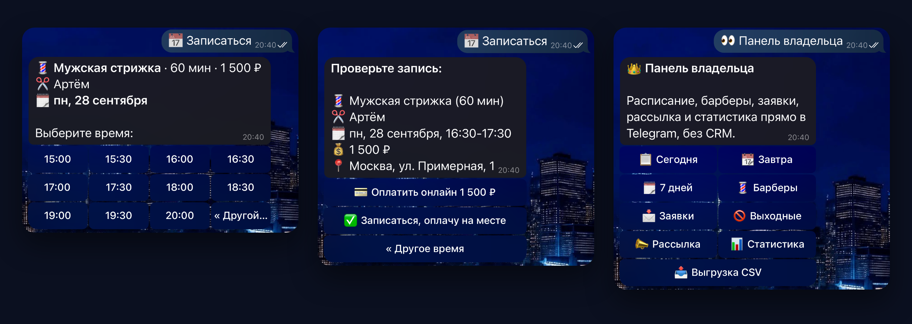

# Бот записи для барбершопа · Telegram booking bot

**RU** · [EN below](#english)

> Живое демо: **[@lezvie_barber_demo_bot](https://t.me/lezvie_barber_demo_bot)** · записаться можно прямо сейчас, оплата тестовая



## Задача

Барбершоп, салон, репетитор, автосервис: записи идут через личку и звонки, администратор переписывает их
в тетрадь, клиенты забывают прийти, а вопросы теряются в переписке. Нужен бот, который сам записывает
к нужному мастеру на свободное время, берёт предоплату, напоминает клиенту, собирает заявки и показывает
владельцу расписание.

## Решение

**Клиент**
- услуга → барбер → день → время. На кнопке барбера его ближайшее свободное время, есть «Любой свободный»;
- показываются только окна, куда услуга влезает целиком. Если мастер один, шаг выбора пропускается;
- номер телефона одной кнопкой «Отправить номер», спрашивается один раз;
- онлайн-оплата через Telegram Payments (ЮKassa) или «оплачу на месте»;
- напоминание за час с кнопками «Приду» и «Не смогу», «Мои записи» с отменой;
- заявка без записи: вопрос или удобное время, телефон кнопкой, номер заявки. Не больше 3 в час.

**Владелец** (`/admin`)
- расписание на сегодня, завтра и любой день недели по барберам, неделя одной сводкой;
- барберы прямо в боте: добавить, рабочие дни, отпуск на даты, скрыть из записи. Бот не даст убрать день
  или поставить отпуск, если на эти даты уже есть записи;
- уведомление о каждой новой записи, заявке, отмене и подтверждении визита;
- выходные салона одной кнопкой, рассылка всем клиентам, статистика за 30 дней с загрузкой барберов,
  выгрузка записей в CSV для Excel.

**Демо-режим** (`DEMO_MODE=1`): панель открыта всем, чужие имена скрыты, общие настройки под замком.
Посетитель получает копию того, что в этот момент получил владелец, и может сразу посмотреть напоминание.
Три демо-барбера, история за 30 дней и записи на неделю вперёд создаются сами. Ненастоящим клиентам
не уходят напоминания и рассылки.

**Надёжность.** Этим бот отличается от «собранного за вечер»:
- двое жмут одно время к одному барберу: запись получает один, второму бот предлагает другое время
  (транзакция `BEGIN IMMEDIATE` и проверка пересечений по барберу, покрыто тестом на гонку);
- «Любой свободный» пробует барберов по очереди, менее загруженных первыми;
- слот под онлайн-оплату держится 15 минут, потом освобождается сам;
- деньги пришли, а слот за это время заняли: клиенту честное сообщение, владельцу сигнал на возврат;
- состояние записи хранится в кнопках и в базе, а не в памяти: после перезапуска старые кнопки работают,
  напоминания не теряются и не дублируются;
- любое необработанное исключение: клиент видит «что-то пошло не так», владелец получает алерт в Telegram
  (не чаще раза в 5 минут на один тип ошибки).

## Стек

Python 3.12 · aiogram 3 · SQLite (aiosqlite, WAL) · Docker · pytest.
Около 3 300 строк кода и 95 тестов, включая сквозные сценарии записи, оплаты, заявок и панели
без реального Telegram. Внешних сервисов, кроме Telegram, не нужно. Запускается на VPS за 200 ₽ в месяц.

```
bot/
  config.py         услуги, часы салона, барберы по умолчанию, настройки из .env
  slots.py          расчёт свободных окон (чистые функции)
  availability.py   окна с учётом барберов, отпусков и выходных
  db.py             SQLite: записи, барберы, заявки, гонки, статистика
  demo.py           демо-данные: клиенты, история, неделя вперёд
  reminders.py      фоновый цикл: напоминания, снятие неоплаченных броней, демо-данные
  handlers/
    client.py       меню и «Мои записи»
    booking.py      путь записи и оплата
    leads.py        заявки
    admin.py        панель владельца
    barbers.py      барберы в панели
    fallback.py     старые кнопки и непонятные сообщения
  app.py            middleware, порядок роутеров, обработчик ошибок
tests/              окна, база, заявки, панель, барберы, демо-данные, сквозные сценарии
```

## Запуск локально

```bash
cp .env.example .env            # вставьте BOT_TOKEN и свой OWNER_IDS
python3.12 -m venv .venv && . .venv/bin/activate
pip install -r requirements-dev.txt
pytest                          # 95 тестов, несколько секунд
python -m bot
```

На ноутбуке запускайте через `caffeinate -i python -m bot`: так Mac не уснёт, пока бот работает.

## Деплой на VPS (Timeweb / Beget / aeza, Ubuntu 24.04)

```bash
ssh root@IP
curl -fsSL https://get.docker.com | sh
git clone https://github.com/nondeadted-kwork/booking-bot.git && cd booking-bot
cp .env.example .env && nano .env
mkdir -p data && chown 1000:1000 data   # бот в контейнере пишет базу от пользователя с uid 1000
docker compose up -d --build
docker compose logs -f bot      # должно быть «Started @your_bot»
```

Обновление: `git pull && docker compose up -d --build`. Бэкап базы: `deploy/backup.sh` в cron.
Вариант без Docker: `deploy/booking-bot.service` (systemd).

**Онлайн-оплата.** @BotFather → `/mybots` → бот → Payments → ЮKassa → «Подключить тестовый».
Полученный токен вставьте в `PAYMENT_TOKEN`. Для боевых платежей нужен договор с ЮKassa,
токен меняется на боевой, код остаётся тот же. Тест ЮKassa требует кабинета в ЮKassa. Для демо без
регистрации подойдёт PayMaster → «Connect PayMaster TEST», его тестовая карта 4100 0000 0000 0001
(впишите её в `TEST_CARD_HINT`, бот покажет её в приветствии).

## Под заказчика

| Что поменять | Где |
|---|---|
| Услуги, цены, длительность | `bot/config.py` → `SERVICES` |
| Часы работы салона, шаг сетки | `bot/config.py` → `Schedule` |
| Барберы, их рабочие дни и отпуска | в самом боте: панель → «💈 Барберы» |
| Название, адрес, телефон | `.env` |
| Свои часы или цены у каждого барбера | около 2 часов работы |
| Google Таблица вместо CSV | около 1 часа работы |

## Что проверено поломкой

Подробно в [BREAK_IT.md](BREAK_IT.md): падение сервера, пропадание сети, повреждённая база, неверный токен
оплаты, старые кнопки, битые данные, гонка за одного барбера, скрытый барбер посреди записи, спам заявками.

---

<a name="english"></a>
## English

**Telegram bot for a barbershop: clients book a chosen barber into a free slot, pay in the chat and get
a reminder an hour before. The owner manages barbers, schedule and leads right in Telegram.**

- **Client:** service → barber → day → time, each barber button shows the nearest free slot, plus “Any free barber”;
  phone number via the Telegram contact button, online payment (Telegram Payments) or pay on site,
  reminder with “I’ll be there / Cancel” buttons, a lead form for questions (3 per hour per person).
- **Owner panel:** day view grouped by barber, week summary, barbers with working days and vacations
  (changes that clash with existing bookings are refused), leads, days off, broadcast, 30-day stats with
  barber load, CSV export.
- **Demo mode:** the panel is open to everyone with other clients masked; visitors get a copy of what the owner
  receives; three demo barbers with 30 days of history and a week of bookings are generated automatically.
- **Reliability:** race-safe booking per barber (`BEGIN IMMEDIATE` transaction, covered by concurrency tests),
  “any free barber” falls back to the next one, 15-minute payment holds that release themselves, state kept
  in callback data and SQLite, a global error handler alerts the owner in Telegram.

**Stack:** Python 3.12, aiogram 3, SQLite, Docker. About 3,300 lines of code, 95 tests including
end-to-end booking, payment, lead and panel flows with a mocked Bot API. Runs on a $3/month VPS.

```bash
cp .env.example .env && docker compose up -d --build
```

Live demo: **@lezvie_barber_demo_bot** (demo mode: the owner panel is open to everyone, other clients’ names are masked).
